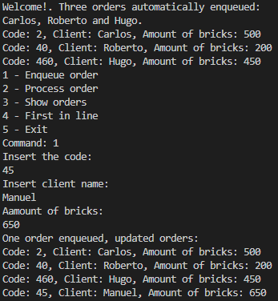
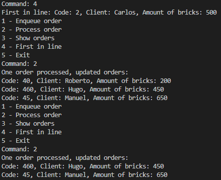

# Queue

This project is a simple implementation of a Queue data structure in Java. The Queue is a linear data structure which follows the First-In-First-Out (FIFO) principle. 
It consists of one a LinkedList, Nodes, and Orders:  
The Order class holds information about an element stored in the queue.  
The Node class represents a node in the linked list and stores an Order object and a reference to the next node.  
The LinkedList class implements the queue using a linked list and has methods to add (enqueue()), remove (dequeue()), and display the queue (showOrders()).

## Screenshots

See orders and enqueue 1:

  
  
Process two orders and the first in are removed:

   
